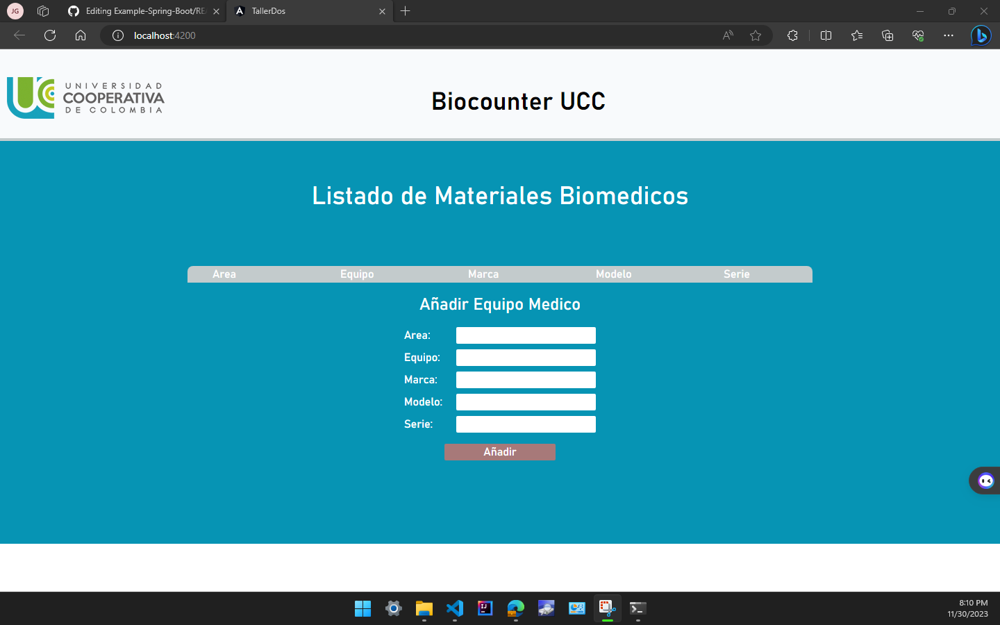
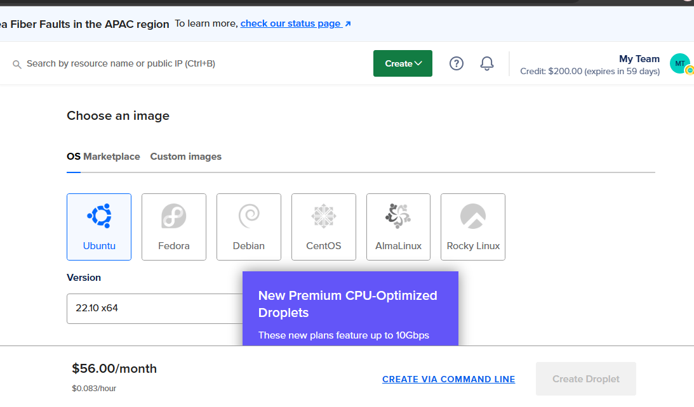
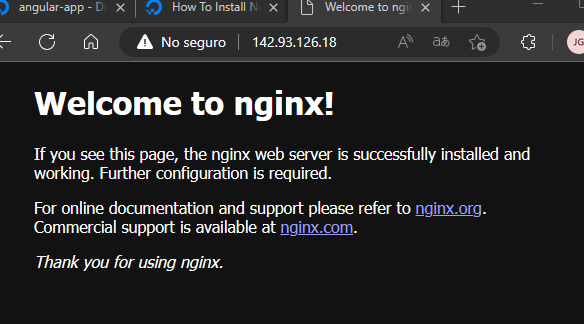
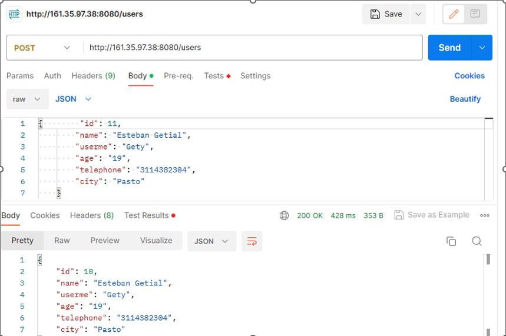
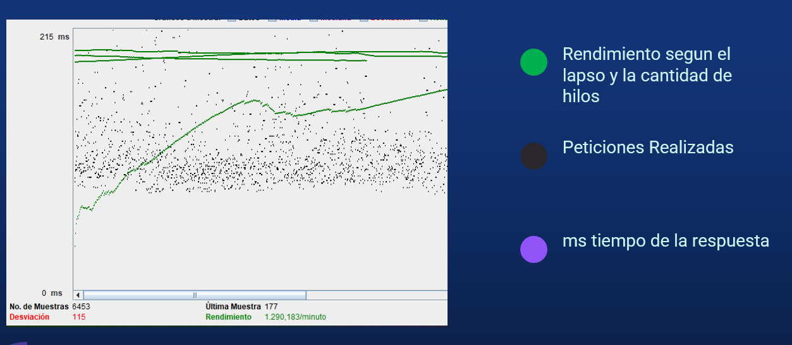
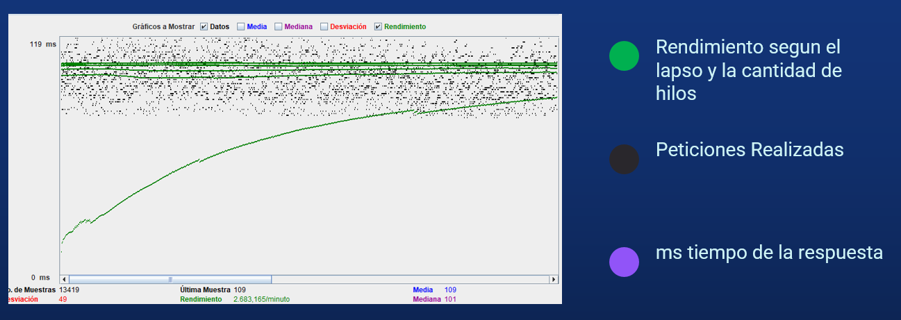

# Example Spring Boot
En este proyecto te mostrare una api spring boot con angular que realiza un CRUD a una lista de Equipos Medicos desplegados en el Cloud Digital Ocean. Un ejemplo sencillo que te puede servir de ayuda para practicar.

## Install

El proyecto se encuetra en dos ramas de git para que descargues y pruebes
Asegúrate de tener instalado los complementos de Angular y SpringBoot y sus respectivos comando de despliegue para que funcione. 

## Aportes Personales 
Una mirada detallada a esta aplicacion fue su despliegue en digital ocean que se realizo adquiriendo un Servidor con ubuntu 22.10 Disco Duro SSD 10Gb y 500mb de Ram donde el backend se realiza con SpringBoot y el frontend con Angular en una arquitectura Rest. 

aqui se tuvo que instalar los respectivos complementos para correr la aplicacion como el nginx.

Se realizo una prueba para verificar que el backend este funcionando. 

En este sistema se realizo Pruebas de Carga con Jmeter donde se envidencia la mejora de rendimiento si implementamos una tecnica muy util para este tipo de aplicaciones que es la memoria Cache, 
es asi como se realizo pruebas con y sin la implementacion del cache dando los siguientes resultados.

## Prueba sin cache

## Prueba con cache

El rendimiento se duplico y el fallo fue menor observando una diferencia clara y optima util para este tipo de aplicaciones.
